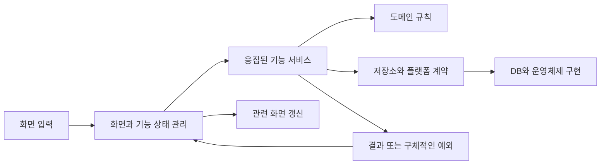

# Clock Rhythm 내부 구조 재설계안

작성일: 2026-10-04

구현 진행과 검증 결과는 [전환 기록](../docs/plans/2026-10-04-flutter-redesign/plan.md)에 남긴다. 현재 구조 조사와 대안 비교는 리팩터링 전 시점을 설명하며, 소스 링크는 전환된 책임의 위치를 가리킨다.

현재 화면과 사용자 동작을 유지하면서, 관련 작업은 응집된 서비스로 모으고 서로 다른 수명을 가진 화면 상태는 분리한다. 도메인 규칙, 저장, 플랫폼 기능과 화면의 책임을 명확히 하되, 실제 역할이 없는 계층이나 인터페이스는 추가하지 않는다.

이 문서는 현재 저장소 조사 결과와 목표 구조, 적용 순서, 검증 기준을 담은 설계안이다. 아래의 새 클래스 이름은 제안이며 아직 구현된 코드가 아니다.

## 1. 목표와 범위

재설계의 대상은 현재 Clock Rhythm Flutter 앱이다. 별도의 Flutter 개발 규칙 스킬을 만드는 작업은 포함하지 않는다.

목표는 다음과 같다.

- 같은 규칙과 저장 경계를 공유하는 작업을 함께 읽고 수정할 수 있게 한다.
- 한 가지 사실의 권위 있는 소유자와 변경 경로를 명확히 한다.
- 화면에 필요한 상태를 사용하는 범위와 유지 기간에 맞게 배치한다.
- 사용자 입력부터 규칙 적용, 저장, 외부 효과, 화면 갱신까지의 흐름이 코드에서 드러나게 한다.
- 공통 구현과 운영체제 전용 구현을 구분하고 앱 시작 지점에서 연결한다.
- 작업 실패와 저장 후 추가 조치가 필요한 상태를 구분한다.
- 현재 동작을 검증하는 테스트를 활용해 기능별로 전환할 수 있게 한다.

다음 계약을 보존한다.

- 기본 화면 구성, 화면 이동, 입력과 조작 방식
- 할 일의 생성, 편집, 완료, 날짜 이동, 표시 순서와 월간 집계
- 집중과 휴식 주기의 시간 계산, 시작, 일시 정지, 재개, 오늘 중지
- 설정의 즉시 적용과 명시적 저장 구분, 편집 초안의 복원
- 언어와 테마 적용, 소리 선택과 미리듣기
- 기존 저장 데이터와 백업 파일의 호환성
- 백업 복원 시 설정과 할 일을 함께 교체하는 원자성
- 현재 지원하는 운영체제별 기능과 동작 범위
- 오류 안내, 재시도, 복구, 접근성과 기존 상태 복원 동작

화면 재배치, 기능 통합이나 삭제, 새 기능, 새로운 지원 플랫폼, 상태 관리 도구 교체, 의존성 버전 업그레이드는 이번 구조 재설계의 목표가 아니다. 내부 구조를 바꾸는 과정에서 별개의 결함을 발견하면 구조 변경과 구분해 기록한다.

## 2. 페이지 조사 결과

### Pages에 저장된 문서

2026-10-04 조사에서 현재 계정으로 접근 가능한 Pages 목록을 마지막까지 조회했으며, 제목이 없는 문서 1개가 반환되었다.

- [제목 없는 Page](https://chatgpt.com/space/page_c14790ea1dbc8191b1d55264785f5406)
- 이 수치는 조회 가능한 목록을 기준으로 한다.
- 해당 문서의 본문은 읽지 않았다.
- 이 설계안은 작업 폴더에 저장한 Markdown 문서이며 Pages에 새로 생성한 문서가 아니다.

### 앱 내부 화면

기본 이동 화면은 5개다. 별도의 예외 상황 페이지 3개를 포함하면 독립된 페이지 위젯은 8개다.

| 구분 | 화면의 역할 | 구현 | 경로 또는 진입 조건 |
| --- | --- | --- | --- |
| 기본 | 시계와 집중 상태, 오늘 할 일 표시 | 시계 화면(ClockPage) | `/clock` |
| 기본 | 날짜별 할 일과 월간 현황 표시 | 캘린더 화면(CalendarPage) | `/calendar`, 선택 날짜 쿼리 |
| 기본 | 데이터 내보내기와 가져오기 | 데이터 화면(DataPage) | `/data` |
| 기본 | 테마 선택 | 테마 화면(ThemePage) | `/theme` |
| 기본 | 주기와 언어, 소리 등 설정 | 설정 화면(PreferencesPage) | `/settings` |
| 예외 | 잘못된 주소나 날짜 안내 | 경로 오류 화면(RouteErrorPage) | 경로 해석 실패 |
| 예외 | 데이터베이스 재시도, 가져오기와 초기화 | 데이터 복구 화면(DatabaseRecoveryPage) | 저장소 시작 실패 |
| 예외 | 앱 실행 환경 구성 실패와 재시도 | 시작 실패 화면(_RuntimeStartupFailurePage) | 실행 환경 초기화 실패 |

로딩 표시, 대화상자, 페이지 제목 위젯과 내부 콘텐츠 위젯은 이 개수에서 제외한다. 시작 실패 화면은 별도 페이지 파일 없이 앱 초기화 파일 안에 선언되어 있다. 따라서 페이지 파일 이름만 세면 독립된 페이지 위젯 수와 차이가 난다.

근거:

- [화면 경로 정의](../lib/app/navigation/app_routes.dart)
- [화면 이동 구성](../lib/app/navigation/app_router.dart)
- [실제 페이지 연결](../lib/app/composition/clock_rhythm_runtime.dart)
- [시작 실패와 데이터 복구 진입](../lib/app/composition/clock_rhythm_bootstrap.dart)

## 3. 현재 구조와 재설계의 근거

### 이미 존재하는 책임 분리

현재 앱에는 도메인 규칙, 사용자 작업, 저장 계약, 플랫폼 구현과 화면 상태가 이미 나뉘어 있다. 전면적인 구조 도입이 필요한 상태로 단정하지 않는다.

할 일 추가를 예로 들면, 화면 상태 관리가 추가 작업을 호출하고, 추가 작업은 제목과 날짜를 도메인 값으로 해석한 다음 할 일 컬렉션의 규칙을 적용해 저장한다. 시간과 식별자 생성도 외부 계약을 통해 공급한다.

현재 기술 기반은 다음과 같다.

| 책임 | 현재 기반 | 설계 방향 |
| --- | --- | --- |
| 화면 상태와 의존성 연결 | Riverpod | 유지하며 소유권 조정 |
| 로컬 데이터베이스 | Drift와 SQLite | 기존 저장 계약 유지 |
| 화면 이동 | go_router | 기존 경로와 복원 동작 유지 |
| 도메인 규칙 | Flutter와 분리된 Dart 객체 | 규칙의 권위자로 유지 |
| 플랫폼 연결 | 앱 조립 코드와 플랫폼 구현 | 공통 구현과 전용 구현의 경계 정리 |

도구체인은 [프로젝트 설정](../.fvmrc)과 [의존성 선언](../pubspec.yaml), [잠금 파일](../pubspec.lock)을 기준으로 유지한다. 조사 시 Flutter 고정 버전은 3.44.7이고 Dart SDK 제약은 `^3.12.2`다. 개별 패키지는 실제 잠금 버전을 따른다.

### 작업별 클래스와 연결 코드

할 일 기능은 생성, 제목 변경, 전체 수정, 완료 전환, 삭제와 조회 등을 각각 별도 작업 클래스로 구성한다. 화면에 필요한 8개 작업을 화면 의존성 묶음(TodoPresentationDependencies)에 다시 모아 전달한다.

이 구조는 각 작업의 경계를 분명하게 한다. 반면 같은 저장소와 도메인 모델을 사용하는 관련 작업을 이해할 때 여러 파일과 객체 연결을 따라가야 한다. 이 비용을 줄이는 것이 서비스 통합의 근거다.

근거:

- [할 일 추가](../lib/contexts/todo/application/todo_command_service.dart)
- [할 일 제목 변경](../lib/contexts/todo/application/todo_command_service.dart)
- [할 일 전체 수정](../lib/contexts/todo/application/todo_command_service.dart)
- [화면에 전달되는 작업 묶음](../lib/contexts/todo/presentation/todo_dependencies.dart)

### 함께 묶인 화면 상태

할 일 화면 상태는 오늘 날짜와 오늘 목록, 캘린더 선택 날짜와 목록, 보고 있는 월과 월별 집계, 수정 진행과 안내 메시지를 함께 가진다. 오늘 할 일 패널과 캘린더가 같은 상태 객체를 구독한다.

설정 화면 상태는 저장된 설정, 편집 초안, 소리 미리듣기, 작업 진행, 실패와 복구 항목을 함께 가진다. 앱 전체의 언어와 테마를 적용하는 루트도 이 설정 화면 상태를 구독한다.

함께 있다는 사실만으로 결함이라고 판정하지 않는다. 각 값의 소비자와 수명, 변경 이유가 다른 부분을 분리해 영향 범위를 명확히 하는 것이 목표다.

근거:

- [할 일 화면 상태와 처리](../lib/contexts/todo/presentation/todo_data_controller.dart)
- [오늘 할 일 표시](../lib/contexts/todo/presentation/today/today_todo_panel.dart)
- [캘린더 표시와 경로 동기화](../lib/contexts/todo/presentation/calendar/calendar_page.dart)
- [설정 화면 상태](../lib/contexts/preferences/presentation/preferences_view_state.dart)
- [설정 처리와 초안 저장](../lib/contexts/preferences/presentation/preferences_data_controller.dart)
- [언어와 테마를 적용하는 앱 루트](../lib/app/presentation/clock_rhythm_root.dart)

### 플랫폼 사이의 구현 공유

조사한 작업 폴더에는 Windows와 Android 구성에 더해 macOS 로컬 실행 구성을 추가하는 변경이 있다. macOS 기능 조립 코드가 Windows 경로에 있는 일부 타이머와 소리 구현을 참조한다.

이를 이유로 Windows 경로의 구현 전체를 공통으로 옮기지는 않는다. 실제로 Dart 타이머나 공통 오디오 기능만 사용하는 부분과 운영체제 전용 API를 사용하는 부분을 정의와 사용처에 따라 구분한다.

현재 macOS 로컬 실행 범위는 앱 실행 중 알림과 소리다. 앱 종료 후나 잠자기 중 예약 알림, Windows의 자동 시작과 트레이 상주, 사용자 MP3 선택을 새로 제공하는 재설계는 아니다. 현재 코드를 확인한 사실과 실제 기기 동작 검증은 구분한다.

근거:

- [플랫폼 선택과 앱 조립](../lib/app/composition/app_composition.dart)
- [macOS 기능 조립](../lib/app/composition/macos_platform_services_factory.dart)
- [현재 지원 범위 설명](../README.md)

## 4. Java 개발 기준에서 가져올 원칙

Java와 Flutter에 공통으로 적용할 핵심은 명확한 타입, 역할이 드러나는 이름, 규칙의 단일 소유자, 의존성의 명시적 전달, 도메인과 저장 기술의 분리다.

| 공통 원칙 | 이 앱에서의 적용 |
| --- | --- |
| 관련 작업의 응집성 | 같은 규칙과 저장 경계의 작업을 서비스 메서드로 묶음 |
| 도메인의 규칙 소유 | 제목, 날짜, 완료 그룹, 주기 계산과 상태 전환은 기존 도메인 객체가 판정 |
| 명확한 입력과 결과 | 의미 있는 명령, 값 객체, 결과, 실패 타입 사용 |
| 저장 모델의 책임 제한 | 데이터베이스 레코드와 JSON 표현은 저장과 변환 역할에 집중 |
| 생성 시 의존성 전달 | 서비스는 필요한 저장소, 시간, 플랫폼 계약을 생성자로 받음 |
| 구체적인 실패 의미 | 실패를 업무 의미에 맞게 구분하고 원인 정보 보존 |
| 읽히는 실행 흐름 | 입력 해석, 규칙 적용, 저장, 외부 효과와 결과 전달 순서를 드러냄 |

Flutter에서는 화면의 재생성, 구독과 자원 해제, 비동기 응답의 순서, 경로 복원, 화면별 상태의 수명을 추가로 다뤄야 한다. 이 책임은 화면 상태 관리와 위젯 생명주기에 맞춰 배치한다.

Spring의 컨트롤러, 빈, 트랜잭션 애너테이션이나 JPA의 저장 모델을 Flutter 구조에 기계적으로 대응시키지 않는다. Dart의 null 허용 타입, 명시적인 반환 타입, 비동기 결과, 값 객체와 필요한 인터페이스를 사용한다. 타입 표기나 이름 정리만을 위해 무관한 파일을 일괄 수정하지 않는다.

새 추상화는 실제 책임이나 외부 경계를 설명해야 한다. 단순 위젯마다 화면 상태 객체를 만들거나, 모든 클래스의 인터페이스를 만들거나, 모든 계층에서 같은 데이터의 사본을 정의하지 않는다.

## 5. 목표 책임 구조

사용자 동작의 실행 흐름은 다음과 같다. 이 그림의 화살표는 실행 흐름이며 소스의 import 방향과는 구분한다.



소스 의존 방향은 다음 책임을 따른다.

- 화면과 상태 관리는 해당 기능의 서비스와 공개 모델을 사용한다.
- 서비스는 도메인과 필요한 외부 계약을 사용한다.
- 도메인은 Flutter, Riverpod, Drift, 라우터와 플랫폼 플러그인에 의존하지 않는다.
- 저장과 플랫폼 구현은 서비스가 요구하는 계약을 구현한다.
- 앱 조립 지점은 실제 구현과 서비스, 상태 소유자를 연결한다.
- 기능 사이의 협력은 기존 공개 진입점으로 이루어진다. 다른 기능의 내부 파일을 직접 사용하지 않는다.

서비스는 사용자 작업의 순서를 조정한다. 화면 표시, 로딩 표시, 스크롤, 포커스나 번역 문장을 소유하지 않는다. 도메인은 규칙을 판정하며 저장과 외부 효과를 실행하지 않는다.

## 6. 기능별 서비스 설계

### 할 일

할 일 변경 서비스(TodoCommandService)는 생성, 제목 변경, 상세 수정, 날짜 이동, 완료 전환, 삭제와 순서 변경을 담당한다. 각 작업은 의미 있는 메서드 이름을 갖고, 입력 해석과 도메인 동작, 저장의 순서를 조정한다.

할 일 조회 서비스(TodoQueryService)는 날짜별 목록과 월간 집계 등 화면에 필요한 조회 계약을 제공한다. 변경 작업과 조회는 각각의 소비자와 효과가 분명하므로 책임을 구분한다. 서비스 내부의 단순 보조 동작까지 별도 클래스로 나누지는 않는다.

제목의 정규화와 길이, 날짜의 의미, 완료 그룹별 순서, 설치당 개수 제한은 기존 할 일 도메인의 책임이다. 서비스 통합을 이유로 이 규칙을 서비스나 위젯에 복사하지 않는다.

기존 저장소의 원자적 변경 계약은 유지한다. 현재 전체 목록을 읽고 쓰는 구현을 부분 갱신 SQL로 바꾸는 성능 작업이나 데이터베이스 형식 변경은 자동으로 포함하지 않는다. 우선 계약과 책임을 정리하고, 다른 저장 알고리즘은 필요와 검증 근거가 있을 때 별도로 다룬다.

### 집중과 휴식 주기

리듬 세션 서비스(RhythmService)는 시작, 일시 정지, 재개, 오늘 중지, 시간 경과에 따른 조정과 설정 변경 후 재예약을 조정한다.

세션의 활성 상태는 하나의 도메인 세션 객체가 소유한다. 각 명령이 세션의 별도 사본을 갖지 않게 한다. 기존 시간 계산과 세션 동기화 책임은 유지하고, 개별 작업 클래스가 같은 의존성을 반복 연결하는 부분을 정리한다.

서비스는 현재 시각을 공급받아 규칙을 적용하고 알림 전달 계약을 호출한다. 일일 주기의 기준 시각, 자정 통과, 이미 지난 이벤트 처리, 일시 정지 후 재개 의미를 보존한다. 운영체제 권한과 전달 가능 여부는 플랫폼 계약으로 확인한다.

### 설정

설정은 사용자 작업의 성격에 따라 다음 서비스 책임으로 묶는다.

| 제안하는 책임 | 포함하는 작업 | 외부 효과 |
| --- | --- | --- |
| 즉시 적용 설정 서비스(PreferencesService) | 저장된 설정 조회, 언어와 테마 변경 | 언어, 테마와 알림 내용 반영 |
| 주기 설정 서비스(RhythmSettingsService) | 초안 조회와 저장, 초안 폐기, 주기 설정 저장 | 주기 재예약, 자동 시작 반영, 초안 동기화 |
| 알림 소리 서비스(NotificationSoundService) | 기본 소리와 사용자 소리 선택, 볼륨, 음소거, 미리듣기 시작과 종료 | 파일 선택과 채택, 오디오 재생과 정지 |

이 구분은 변경 이유와 외부 의존성에 따른 것이다. 서비스 수를 맞추기 위해 위임만 하는 계층을 추가하지 않는다. 기존 복구 동작은 해당 작업의 서비스가 담당하며, 복구 필요 항목의 공통 상태는 하나의 소유자가 관리한다.

설정 저장이 끝난 뒤 주기 재예약, 자동 시작, 초안 갱신 중 일부가 실패할 수 있다. 이 경우 저장된 값과 추가 조치가 필요한 항목을 함께 반환한다. 영속 데이터가 저장되었는지와 외부 효과가 적용되었는지를 별도로 판단한다.

### 백업

백업 내보내기, 가져오기 준비, 가져오기 확정은 독립된 흐름으로 유지한다. 각각 파일 선택과 읽기, 형식 검사, 미리보기, 여러 데이터의 교체, 외부 효과와 후속 갱신이라는 별도 계약을 가진다.

백업을 일반적인 설정 변경 메서드에 합치지 않는다. 가져오기 확정은 공개된 기능 계약과 일괄 교체 계약을 조정하며, 데이터베이스 구현과 화면 상태를 직접 다루지 않는다.

기존 작업 클래스가 충분히 응집되어 있으면 유지한다. 서비스 통합은 모든 Use Case를 없애는 규칙이 아니다.

## 7. 상태 소유권과 수명

저장된 데이터의 권위자는 저장소다. 화면에서 공유하는 데이터 소유자는 그 저장소를 읽어 만든 현재 표시용 상태와 갱신을 관리한다. 이 표시용 상태는 별도의 영속 데이터 권위자가 아니다.

| 상태 | 목표 소유자 | 수명과 소비자 |
| --- | --- | --- |
| 저장된 할 일 | 할 일 저장소 | 앱 재시작 이후에도 유지 |
| 공유 할 일 조회 결과와 변경 진행 | 할 일 데이터 관리(TodoDataController) | 오늘 목록과 캘린더가 함께 사용 |
| 오늘 날짜 | 기존 날짜 시계 계약을 사용하는 공통 제공자 | 자정과 앱 복귀 시 갱신 |
| 캘린더 선택 날짜 | 경로의 날짜가 우선하는 캘린더 입력 경계 | 주소 진입과 뒤로 가기 복원 반영 |
| 보고 있는 월과 캘린더 표시 상태 | 캘린더 상태 관리(CalendarViewModel) | 기존 화면 유지와 복원 계약에 맞춤 |
| 입력 중인 제목, 포커스와 스크롤 | 해당 입력 위젯과 페이지 | 기존 편집과 복원 수명 유지 |
| 저장된 설정과 복구 항목 | 설정 데이터 관리(PreferencesDataController) | 앱 루트, 설정과 테마 화면이 공유 |
| 설정 작업 사이의 기존 진행 제약 | 설정 기능의 공통 작업 소유자 | 기존 중복 실행과 쓰기 충돌 방지 유지 |
| 주기 설정 초안 | 설정 편집 상태 관리(RhythmSettingsEditor) | 기존 기기 저장과 복원 계약 유지 |
| 미리듣기 표시 상태 | 소리 미리듣기 관리(SoundPreviewController) | 현재 재생과 완료, 정지 흐름에 맞춤 |
| 오디오와 타이머 자원 | 해당 플랫폼 구현 | 생성 주체가 정지와 해제 담당 |
| 실제 리듬 세션 | 리듬 서비스에 연결된 단일 도메인 세션 | 현재 앱과 플랫폼 복구 계약에 맞춤 |
| 백업 미리보기와 적용 진행 | 백업 화면 상태 관리 | 현재 백업 흐름 동안 유지 |

### 데이터 갱신

할 일 변경의 기본 흐름은 다음과 같다.

1. 화면이 사용자 의도를 가진 명령을 전달한다.
2. 공통 데이터 관리가 기존 수정 진행 상태를 반영하고 서비스를 호출한다.
3. 서비스가 도메인 규칙을 적용하고 저장소 변경을 완료한다.
4. 공통 데이터 관리가 관련 조회 결과를 갱신한다.
5. 오늘 목록과 캘린더는 같은 갱신 결과를 사용한다.

갱신 책임을 각 화면에 중복 구현하지 않는다. 오늘 목록이 캘린더 상태 객체를 직접 수정하거나, 캘린더가 오늘 목록의 상태를 직접 다시 읽게 하는 연결도 만들지 않는다.

초기 전환은 기존의 명시적 조회와 갱신 흐름을 공통 소유자로 옮기는 방식으로 진행할 수 있다. 데이터베이스 변경 스트림이나 전역 이벤트 버스를 새로 도입하는 것을 전제하지 않는다. 공통 조회 결과는 화면별 조회의 캐시일 수 있지만, 동일한 결과를 여러 변경 가능한 저장소에 복제하지 않는다.

변경은 성공했으나 후속 조회가 실패한 경우, 현재 테스트가 보장하는 오래된 작업 버튼 차단과 오류 표시를 유지한다. 상태 분리를 이유로 이전 데이터에서 계속 수정하게 만드는 동작 변경을 섞지 않는다.

### 화면별 상태

오늘 목록은 날짜와 공유 데이터에서 필요한 값을 읽는다. 독립적인 변경 상태가 없다면 별도 ViewModel 클래스를 만들 필요가 없다. 단순한 읽기 제공자와 위젯 조합으로 충분하다.

캘린더가 경로의 선택 날짜를 화면 상태에 반영할 때 동기화 방향을 한곳에 둔다. 주소에 날짜가 있으면 그 값을 사용하고, 날짜가 없는 진입은 현재 기본 동작을 따른다. 경로와 화면이 서로 다른 날짜를 독립적으로 확정하지 않게 한다.

보고 있는 월, 날짜 선택과 자정 전환의 기존 관계를 보존한다. 과거의 오늘을 따라가던 선택과 사용자가 명시적으로 고른 날짜의 처리 차이를 유지한다. 늦게 완료된 과거 조회가 최신 선택을 덮지 않도록 현재의 요청 순서 계약을 옮긴다.

편집 초안은 단순한 화면 임시값으로 축소하지 않는다. 현재 초안 저장 순서, 저장 실패 시 미저장 초안 보존, 테마 변경 시 초안 유지, 명시적 저장 후 초안 동기화를 유지한다.

### 공통 진행 상태와 자원 해제

상태 분리는 독립적인 동시 쓰기를 새로 허용한다는 뜻이 아니다. 현재 할 일 수정 중 다른 수정이나 선택의 제약, 설정의 공통 작업 진행 제약, 백업 적용 중 변경 중지 계약은 기존 관찰 가능한 동작에 맞춰 보존한다. 새 전역 잠금이나 운영 차단 장치를 추가하지 않는다.

초안 저장은 현재 순차 실행과 최신 결과 반영을 유지한다. 소리 미리듣기는 이전 재생의 늦은 완료가 새 재생 상태를 덮지 않게 하고, 소리 설정 변경에 따른 정지도 보존한다.

화면 상태를 분리하면서 자동 폐기 정책을 일괄 추가하지 않는다. 현재 유지되는 초안, 페이지 전환 상태와 재생 자원의 수명을 먼저 대응시킨다. 구독, 타이머, 컨트롤러와 오디오의 생성 주체와 해제 주체가 일치해야 한다.

## 8. 성공, 실패와 부분 성공

기본 계약은 다음과 같다.

| 상황 | 서비스의 표현 | 화면 상태 관리의 역할 |
| --- | --- | --- |
| 일반 성공 | 의미 있는 반환값 또는 완료 | 공유 데이터와 기존 성공 안내 갱신 |
| 작업 실패 | 구체적인 실패 예외 | 처리 가능한 실패를 기존 안내와 재시도 상태로 변환 |
| 저장 후 일부 효과 미적용 | 저장된 데이터와 복구 항목을 가진 결과 | 저장 사실을 유지하고 해당 복구 동작 제공 |
| 예기치 않은 오류 | 원인과 호출 정보를 보존한 예외 | 해당 실행 경계에서 기존 오류 표시와 진단 처리 |

할 일 저장 실패와 저장 후 화면 갱신 실패는 같은 사건이 아니다. 설정 저장 실패와 저장 후 알림 적용 실패도 구분한다. 실패를 무관한 빈 목록이나 정상 완료로 바꾸지 않는다.

저장된 설정과 복구 필요 항목을 반환하는 현재 결과 모델을 활용한다. 저장 후 외부 효과가 실패했다고 이미 저장된 설정을 이전 값으로 되돌린 것처럼 표시하거나 동일 저장을 무조건 재실행하지 않는다.

예외를 다른 계층의 의미로 바꿀 때 원인을 보존한다. 저장소와 플랫폼 구현의 실패를 무관한 도메인 실패로 바꾸지 않는다. 예기치 않은 프로그래밍 오류를 일반적인 사용자 입력 오류로 위장하지 않는다.

문구는 표시 계층이 소유한다. 도메인과 서비스는 번역 문장 대신 실패 타입, 의미 있는 코드와 필요한 정보를 전달한다. 동일 오류를 모든 계층에서 중복 기록하는 구조는 만들지 않는다.

## 9. 저장과 백업의 보존 계약

현재 하나의 SQLite 데이터베이스에 설정과 할 일을 저장한다. 물리적으로 같은 데이터베이스를 사용하더라도 규칙과 데이터의 논리적 소유권은 각각 설정과 할 일 기능에 있다.

이번 재설계는 데이터베이스 형식 변경이나 새 백업 버전을 요구하지 않는다. 현재 저장 모델을 유지하고 서비스와 화면의 계약을 정리한다. 데이터베이스 구현을 도메인 객체로 대신하거나 화면에 데이터베이스 레코드를 노출하지 않는다.

백업 복원은 다음 계약을 보존한다.

1. 전체 파일을 해석하고 검증한 뒤 교체 요약을 표시한다.
2. 사용자가 확정하면 기존 리듬 이벤트와 활성 소리를 중지한다.
3. 적용 중에는 현재 계약에 따라 사용자 변경 작업을 중지한다.
4. 설정과 할 일은 하나의 데이터베이스 트랜잭션에서 교체한다.
5. 검증 또는 영속 저장 실패는 기존 데이터를 보존해야 한다.
6. 기기별 소리 경로 저장 실패에 대한 기존 보상과 복구 계약을 유지한다.
7. 운영체제 자동 시작 등 데이터베이스 밖의 효과는 저장 결과와 별도로 반영한다.
8. 외부 효과 적용에 실패해도 이미 가져온 데이터의 저장 사실과 복구 항목을 함께 유지한다.
9. 성공 후 설정, 초안, 할 일과 리듬 표시를 공통 갱신 경로로 갱신한다.
10. 후속 갱신만 실패했다면 데이터를 다시 가져오기보다 기존 갱신 재시도 계약을 따른다.

리듬과 소리를 미리 중지하는 효과는 데이터베이스 트랜잭션과 함께 되돌릴 수 없다. 현재 백업 계약에 따라 가져오기 확정 후 리듬은 자동 시작되지 않고 명시적 시작을 기다린다. 이 차이를 서비스 결과와 복구 흐름에서 유지한다.

설정 저장은 데이터베이스뿐 아니라 기기별 소리 경로 저장과도 연결된다. 따라서 데이터베이스 변경 알림만으로 모든 설정 변경이 완결되었다고 가정하지 않는다.

근거:

- [할 일 저장 구현](../lib/app/infrastructure/persistence/repositories/drift_todo_repository.dart)
- [설정 저장 구현](../lib/app/infrastructure/persistence/repositories/drift_settings_repository.dart)
- [백업 일괄 교체](../lib/app/infrastructure/persistence/drift_backup_replacement_adapter.dart)
- [가져오기 확정 작업](../lib/features/data_transfer/application/confirm_backup_import.dart)
- [가져오기 후 갱신](../lib/app/infrastructure/provider_data_import_refresh_adapter.dart)
- [백업 호환성과 복원 계약](../docs/adr/0007-keep-backup-version-one-portable.md)

## 10. 디렉터리와 공개 경계

최상위 기능 구분은 유지한다. 페이지 수와 도메인 수를 일대일로 맞추지 않는다. 예를 들어 시계 화면은 리듬과 오늘 할 일을 함께 보여주는 조합 화면이고, 테마와 설정 화면은 같은 설정 데이터에 접근한다.

다음은 책임 배치의 개략도다. 모든 하위 폴더나 파일을 미리 생성한다는 뜻은 아니다.

```text
/Users/huple/Documents/projects/clock-app/lib/
  app/
    composition/                앱 시작, 의존성 연결, 수명 관리
    navigation/                 전체 경로와 복원 연결
    presentation/               기능 조합 화면과 앱 루트, 복구 화면
    infrastructure/
      persistence/              공유 DB와 일괄 교체, 저장 구현 연결
      device_state/             기기별 경로와 상태 저장
  contexts/
    todo/
      domain/                   할 일 규칙과 값
      application/              변경과 조회 서비스, 저장 계약
      presentation/             공유 데이터 관리, 오늘 목록과 캘린더
    rhythm/
      domain/                   시간과 세션 규칙
      application/              세션 서비스와 전달 계약
      infrastructure/           공통 전달 구현과 운영체제별 구현
      presentation/             리듬 표시와 사용자 명령
    preferences/
      domain/                   설정 값과 초안의 규칙
      application/              설정과 소리 서비스, 외부 계약
      infrastructure/           공통 소리 구현과 운영체제별 구현
      presentation/             저장 설정, 편집, 미리듣기의 상태
  features/
    data_transfer/
      application/              백업 내보내기, 준비와 확정
      infrastructure/           JSON 백업의 해석과 생성
      presentation/             미리보기, 진행과 복구 표시
  shared/                       도메인에 종속되지 않는 UI와 공통 기능
```

같은 SQLite 연결과 백업 트랜잭션을 조립하는 현재 저장 구현을 억지로 각 도메인 안으로 옮기지 않는다. 기능의 저장 계약은 해당 기능이 소유하고, 앱 인프라 구현은 그 공개 계약을 구현할 수 있다. 반대로 기능이 앱 내부 데이터베이스를 직접 참조하는 의존성은 만들지 않는다.

현재 공개 파일(public.dart, public_model.dart, public_presentation.dart)의 역할은 유지하면서 외부 소비자가 필요한 서비스와 모델을 노출한다. 모든 내부 타입을 일괄 재노출하지 않는다. 다른 기능이 화면 상태 객체를 거쳐 도메인 작업을 실행하는 구조도 피한다.

현재 기능 구분을 별도 Dart 패키지로 쪼개는 작업은 포함하지 않는다. 공통 폴더에는 도메인과 무관하고 같은 의미로 함께 변경되는 코드만 둔다. 리듬 전달처럼 도메인 계약을 아는 구현은 여러 플랫폼이 사용하더라도 리듬 기능 안에 둔다.

근거:

- [기존 기능 경계 결정](../docs/adr/0005-preserve-context-boundaries-in-dart.md)
- [기존 기술 기반 결정](../docs/adr/0006-use-riverpod-drift-and-go-router.md)
- [기존 경계 검증](../test/architecture/module_boundaries_test.dart)
- [공개 진입점 검증](../test/architecture/public_surfaces_test.dart)

## 11. 플랫폼 조립과 앱 수명

운영체제 선택은 앱 조립 지점에 둔다. 서비스와 도메인이 운영체제 이름으로 분기하지 않도록 필요한 기능의 계약을 받는다.

앱 초기화는 저장소 열기, 저장 설정 읽기, 세션과 플랫폼 구성, 화면 상태 연결, 실패 시 자원 해제를 책임진다. 초기화에 필요한 데이터 읽기는 이 흐름에 포함되지만, 도메인 정책을 초기화 코드에 복사하지 않는다.

기존 실행 환경 조립 객체(ClockRhythmRuntime)는 앱 수명과 전체 연결을 맡는다. 서비스 통합으로 불필요해진 작업별 생성 코드를 줄이고, 기능별 연결이 독립된 책임으로 남을 때만 작은 조립 단위로 나눈다. 파일 길이만을 이유로 팩토리와 등록기를 늘리지 않는다.

Windows 경로에서 공유하던 구현은 다음 기준으로 정리한다.

- 운영체제 API 없이 공통 타이머를 사용하는 리듬 전달은 리듬 기능의 공통 구현 후보로 둔다.
- 공통 오디오 라이브러리를 사용하는 재생 기능은 소리 기능의 공통 구현 후보로 둔다.
- 알림, 권한, 트레이, 자동 시작과 플랫폼 채널은 해당 운영체제 구현으로 유지한다.
- 파일 이름만 바꾸지 않고 파라미터, 결과, 오류 타입과 공개 계약에도 운영체제 전용 의미가 있는지 확인한다.
- 실제 공통 계약이 다른 구현은 억지로 하나로 합치지 않는다.

기존 Mac 실행 추가 작업과 그 파일은 보존한다. 적용 시점에는 최신 작업 상태를 다시 확인해 이미 바뀐 파일과 조립 코드를 기준으로 전환한다. 이번 설계가 해당 플랫폼 작업의 빌드나 실제 동작 검증을 대신하지 않는다.

## 12. 비교한 대안과 선택 근거

| 판단 대상 | 채택한 방향 | 비교한 대안 | 선택 이유와 감수할 점 |
| --- | --- | --- | --- |
| 결과물 | 현재 앱의 구체적인 재설계안 | 재사용 가능한 Flutter 개발 규칙 스킬 | 실제 기능과 의존성에 근거해 바꿀 위치와 책임을 정할 수 있음 |
| 사용자 경험 | 화면과 동작 보존 | 기능은 유지하면서 메뉴, 화면 이동과 저장 방식 변경 | 구조 변경의 효과를 기존 동작과 분리해 평가할 수 있음 |
| 제품 범위 | 현재 기능 유지 | 기능이나 화면의 통합과 제거 | 기존 제품 계약을 기준으로 회귀를 판단할 수 있음 |
| 작업 분할 | 같은 책임의 작업을 서비스 메서드로 묶음 | 작업 하나당 클래스 유지 | 관련 코드와 연결을 함께 읽을 수 있음. 서비스가 여러 책임을 흡수하지 않도록 경계를 유지해야 함 |
| 복합 흐름 | 백업 등 독립적 작업 흐름 유지 | 모든 작업을 일반 서비스 메서드에 통합 | 서로 다른 기능과 저장 효과를 조정하는 계약을 명확히 보존함 |
| 화면 상태 | 공유 데이터와 화면별 상태 분리 | 기능별 큰 상태 객체 유지, 필요한 값만 구독 | 변경 이유와 수명을 구분할 수 있음. 공통 데이터 갱신과 기존 진행 제약을 별도로 보존해야 함 |
| 플랫폼 범위 | 공통 로직과 Windows, Android, macOS 연결 경계 포함 | 공통 도메인과 화면만 변경 | 이미 존재하는 플랫폼 사이의 구현 공유를 함께 정리할 수 있음. 플랫폼별 검증 범위가 넓어짐 |
| 실패 전달 | 성공 반환값, 구체적 실패 예외, 부분 성공 결과 | 예상 가능한 성공과 실패를 모두 결과 타입으로 반환 | 기존 예외와 부분 성공 모델을 활용할 수 있음. 호출부의 처리 경계와 예외 의미가 명확해야 함 |
| 도구와 구조 | 기존 Riverpod, Drift, go_router와 기능 구분 유지 | 새로운 도구나 폴더 템플릿으로 전면 전환 | 이번 문제를 해결하는 데 필요하지 않은 마이그레이션을 줄임 |
| 적용 방식 | 할 일부터 기능별 전환 | 전체 기능을 한 번에 전환 | 대표 기능에서 책임 분리와 검증 방식을 확인한 뒤 확장할 수 있음 |

예상 가능한 실패를 결과 타입으로 표현하는 방식도 유효하다. 모든 호출부가 성공과 실패를 명시적으로 분기하게 하는 장점이 있다. 다만 현재 앱에는 구체적인 실패 예외와 저장 후 복구 정보를 담는 결과가 이미 있으므로, 이번 설계에서는 그 의미를 정리하는 쪽을 택한다.

## 13. 적용 순서

### 준비: 현재 동작과 변경 중인 파일 확인

실제 구현을 시작할 때 최신 작업 상태와 기존 테스트를 확인한다. 특히 macOS 실행 추가 변경과 겹치는 파일을 보존한다. 기존 공개 계약, 경로, 데이터 형식, 오류와 재시도 동작을 각 전환 단계의 기준으로 삼는다.

새 구현을 배치할 구조가 필요하더라도 비어 있는 계층이나 아직 사용하지 않는 클래스를 먼저 만들지 않는다. 각 기능의 소비자까지 연결되는 단위로 전환한다.

### 첫 번째: 할 일

1. 생성과 변경, 조회의 공개 서비스 계약을 정한다.
2. 기존 작업의 규칙과 저장 순서를 서비스 메서드로 옮긴다.
3. 공통 데이터 갱신과 수정 진행 책임을 화면 탐색 상태에서 분리한다.
4. 오늘 목록은 필요한 공유 데이터를 읽고, 캘린더는 경로와 탐색 상태를 관리하게 한다.
5. 편집, 순서 변경, 자정 전환, 오래된 응답, 저장 후 갱신 실패와 복원 계약을 검증한다.
6. 소비자가 모두 전환된 작업 클래스와 연결 코드는 제거한다.

할 일은 두 화면의 공유 데이터, 도메인 규칙, 저장, 서비스 통합과 화면 상태 분리를 함께 검증할 수 있어 첫 대상에 적합하다.

### 두 번째: 설정

1. 저장된 설정과 공통 복구 상태를 설정 편집 상태에서 분리한다.
2. 즉시 적용 설정, 주기 설정과 소리 처리의 서비스 책임을 정리한다.
3. 앱 루트가 저장된 언어와 테마를 구독하도록 바꾼다.
4. 초안 저장 순서와 복원, 미리듣기 자원 수명, 기존 공통 진행 제약을 보존한다.
5. 저장 실패, 저장 후 효과 실패, 초안 보존과 복구를 검증한다.

### 세 번째: 리듬과 플랫폼 연동

1. 세션을 조정하는 작업들을 응집된 서비스에 연결한다.
2. 기존 시간과 상태 전환 규칙을 유지한다.
3. 공통 타이머와 오디오 구현의 실제 의존성을 확인해 플랫폼 전용 구현과 구분한다.
4. Windows, Android와 macOS의 앱 조립 코드를 새 서비스 계약에 연결한다.
5. 권한, 알림 전달, 복구, 앱 수명과 자원 해제를 플랫폼별로 검증한다.

### 네 번째: 백업과 앱 전체 연결

1. 백업 흐름이 새 서비스와 공개 계약을 사용하도록 연결한다.
2. 일괄 교체와 기기별 상태 보상, 저장 후 외부 효과를 보존한다.
3. 가져오기 후 공통 데이터 소유자와 편집 상태의 갱신을 연결한다.
4. 초기화 실패와 데이터 복구 경로를 새 구조에 연결한다.
5. 전체 경로와 백업 왕복, 화면 간 갱신과 플랫폼 연결을 통합 검증한다.

이 순서는 구현을 작은 단위로 나누는 방식이다. 각 단계마다 새로운 수동 승인 절차를 추가하는 설계가 아니다. 영구적인 호환 계층은 만들지 않으며, 임시 연결이 꼭 필요하다면 해당 전환 단계에서 소비자를 옮긴 뒤 제거한다.

## 14. 검증 기준

### 기존 증거 활용

현재 저장소에는 도메인, 서비스 역할의 작업, 화면 상태, 위젯, 저장소, 백업 원자성과 기능 경계를 확인하는 테스트가 있다. 같은 행동을 유지하는 기존 테스트는 새 구조에 맞게 연결하고, 구현 클래스가 바뀌었다는 이유만으로 같은 계약의 테스트를 중복 작성하지 않는다.

| 검증 대상 | 보존해야 할 행동 | 기존 근거 |
| --- | --- | --- |
| 할 일 변경 | 생성, 편집, 완료, 삭제와 순서, 한 작업의 원자성 | [할 일 작업 테스트](../test/contexts/todo/application/todo_commands_test.dart) |
| 할 일 조회 | 날짜별 순서와 월간 집계 | [조회와 스냅샷 테스트](../test/contexts/todo/application/todo_queries_and_snapshots_test.dart) |
| 공유 할 일 상태 | 두 화면 갱신, 최신 선택 반영, 자정 처리, 갱신 실패 | [할 일 상태 테스트](../test/contexts/todo/presentation/todo_view_model_test.dart) |
| 캘린더 | 경로 날짜 반영, 탐색과 복원 | [캘린더 화면 테스트](../test/contexts/todo/presentation/calendar/calendar_page_test.dart) |
| 설정 편집 | 초안 복원, 저장 실패 시 초안 보존, 테마 변경과 초안 독립성 | [설정 상태 테스트](../test/contexts/preferences/presentation/preferences_view_model_test.dart) |
| 설정 작업 | 저장 후 효과 적용과 복구 결과 | [설정 작업 테스트](../test/contexts/preferences/application/preferences_use_cases_test.dart) |
| 리듬 | 고정된 시간 기준, 상태 전환과 예약 조정 | [리듬 작업 테스트](../test/contexts/rhythm/application/rhythm_use_cases_test.dart) |
| 저장소 | 도메인과 저장 표현의 왕복 | [저장소 테스트](../test/app/infrastructure/persistence/repositories_test.dart) |
| 백업 | 두 데이터 집합의 일괄 교체와 실패 시 보존, 외부 효과 실패 | [교체 원자성 테스트](../test/app/infrastructure/persistence/replacement_atomicity_test.dart) |
| 화면 이동 | 기존 주소와 날짜 파싱 | [경로 테스트](../test/app/navigation/app_routes_test.dart) |
| 초기화 복구 | 데이터베이스 복구 화면과 사용자 동작 | [복구 화면 테스트](../test/app/presentation/recovery/database_recovery_page_test.dart) |
| 구조 | 도메인 독립성과 기능 공개 경계 | [기능 경계 테스트](../test/architecture/module_boundaries_test.dart) |

위 표는 확인할 기존 테스트의 위치이며 이번 설계 작업에서 실행해 통과를 확인했다는 뜻은 아니다.

### 상태 분리에서 집중할 회귀

- 오늘 목록에서 완료한 결과가 캘린더에도 반영되고, 반대 방향도 동일하게 갱신되는가.
- 빠르게 날짜나 월을 바꿀 때 이전 응답이 최신 선택을 덮지 않는가.
- 자정과 앱 복귀 시 오늘 목록과 명시적으로 선택한 날짜가 기존 규칙대로 처리되는가.
- 수정 중 입력과 이동의 기존 제약이 상태 분리 후에도 유지되는가.
- 저장 성공 후 조회 실패가 중복 저장이나 오래된 데이터의 추가 변경으로 이어지지 않는가.
- 언어와 테마를 바꿔도 편집 초안이 사라지지 않는가.
- 빠른 초안 변경이 저장 순서를 뒤집지 않는가.
- 저장된 설정과 미적용 외부 효과를 구분해 표시하고 복구하는가.
- 소리 미리듣기의 정지와 늦은 완료, 객체 해제가 기존 계약을 보존하는가.
- 백업 복원 후 설정과 할 일, 초안, 리듬 표시가 함께 갱신되는가.
- 데이터 복구 화면과 앱 초기화 실패 경로도 정상 기능과 같은 새 저장 계약을 사용하는가.

기존 테스트가 같은 경로와 경우를 이미 다루면 그 증거를 활용한다. 새로 생기는 소유권이나 연결 때문에 확인되지 않는 행동이 있으면 가장 가까운 책임 경계에 집중된 테스트를 추가한다.

### 실행 범위

실제 코드 변경 단계에서는 프로젝트의 고정 도구체인과 기존 검증 절차를 사용한다. 변경된 코드의 형식, 정적 분석, 관련 테스트를 먼저 확인하고, 공개 경계와 앱 연결을 바꾼 경우 기존 구조 검사와 통합 테스트를 포함한다.

플랫폼 구현을 바꾸면 해당 운영체제에서 빌드와 실제 동작을 확인한다. Windows와 Android의 검증을 macOS에서 실행한 테스트로 대체하지 않는다. 현재 macOS 지원 범위를 넘어서는 종료 후 알림이나 잠자기 동작을 완료 기준으로 새로 추가하지 않는다.

명령과 환경 계약은 [기존 검증 문서](../docs/verification/ci-gates.md)를 따른다. 기존 검사를 변경해야 한다면 바뀐 실제 경계에 맞게 조정하며, 구조 재설계를 이유로 새로운 영구 빌드, 배포나 실행 차단 검사를 추가하지 않는다. 기존 절차에 포함된 생성물 비교 등의 비용도 해당 변경에 필요한 근거와 범위를 확인한 뒤 판단한다.

화면 구성과 접근성 동작을 바꾸지 않으므로 불필요한 시각 재설계를 하지 않는다. 위젯 연결을 바꾼 부분은 포커스, 키보드 조작, 스크린 리더 안내와 기존 오류 표시의 회귀를 확인한다.

## 15. 완료 기준과 현재 한계

향후 구현은 다음 조건을 충족했을 때 이 설계에 도달한 것으로 판단한다.

- 관련 작업이 응집된 서비스에 모이고, 단순 전달을 위한 이전 작업 클래스와 연결 코드가 정리되어 있다.
- 도메인 규칙과 외부 효과가 서비스, 저장소와 화면에 중복되지 않는다.
- 오늘 목록과 캘린더가 공유 데이터의 동일한 갱신 흐름을 사용한다.
- 저장된 설정, 초안과 미리듣기의 소유자와 수명이 구분되어 있다.
- 상태 분리 이후에도 기존 진행 제약, 복원과 실패 동작이 보존된다.
- 앱 전체의 언어와 테마가 편집 화면의 상태에 종속되지 않는다.
- 서비스와 도메인이 운영체제 선택과 구현에 직접 의존하지 않는다.
- 공통 구현과 플랫폼 전용 구현의 이름과 의존 관계가 실제 역할에 맞는다.
- 저장과 백업의 형식, 교체 원자성, 부분 성공과 복구 계약이 유지된다.
- 기존 공개 경계와 관련 동작 검증이 새 구조에서 확인된다.
- 수행하지 못한 플랫폼 검증은 남은 항목으로 명확히 구분된다.

이번 작업은 소스, 선언된 계약과 기존 테스트를 읽어 설계안을 작성한 단계다. 앱 구현을 변경하거나 빌드, 테스트와 실기기 검증을 실행하지 않았다. 따라서 현재 앱 전체의 정확성이나 macOS 실행 구성의 동작 완료를 보증하는 문서는 아니다.

## 16. 참고 자료

- [Flutter 공식 앱 아키텍처 가이드](https://docs.flutter.dev/app-architecture/guide): 화면, 화면 상태, 저장소와 외부 서비스의 책임 분리, 필요에 따른 추가 작업 계층을 설명한다. 이 문서의 모든 예시를 현재 앱에 일괄 적용하지 않고 실제 책임과 기존 계약에 맞춰 사용한다.
- [Flutter 공식 결과 패턴 설명](https://docs.flutter.dev/app-architecture/design-patterns/result): 성공과 실패를 결과 타입으로 전달하는 대안을 설명한다. 이 설계는 기존 구체적 예외와 부분 성공 모델을 활용하는 방향을 채택한다.
- [제품 용어와 의미](../CONTEXT.md): 리듬, 세션, 설정 초안, 할 일과 백업의 의미를 정의한다.
- [기존 기능 경계](../docs/adr/0005-preserve-context-boundaries-in-dart.md): 앱, 리듬, 할 일, 설정과 백업의 경계를 기록한다.
- [기존 상태, 저장과 화면 이동 기반](../docs/adr/0006-use-riverpod-drift-and-go-router.md): 현재 기술 선택의 이유를 기록한다.
- [백업 호환성과 교체 계약](../docs/adr/0007-keep-backup-version-one-portable.md): 백업 형식, 일괄 저장과 외부 효과의 구분을 기록한다.
